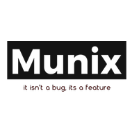
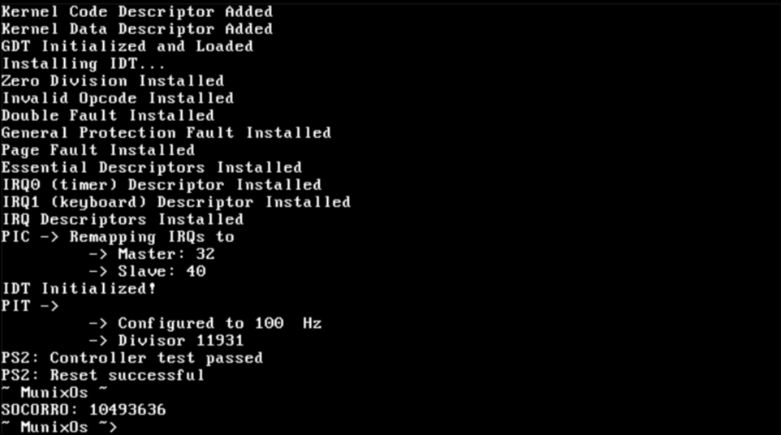
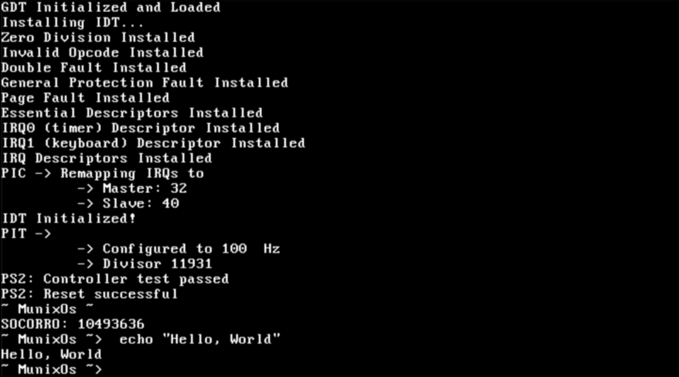

# Munix



**Un sistema operativo hecho desde 0, que, increíblemente funciona**

[](https://opensource.org/licenses/GPL-3.0)


## 📌 Descripción

Munix es un sistema operativo monolítico escrito desde cero en C y NASM, actualmente en fase de prototipo.

## 🚀 Características Principales

- **Kernel monolítico** escrito en C y ensamblador (NASM)
- **Shell revolucionaria** con lenguaje propio
  - Variables "inexistentes" (basadas en números para eficiencia de memoria)
  - Lexer, parser y evaluador personalizados
- Soporte para MBR (Master Boot Record)
- **Librería estándar personalizada** (parcialmente compatible con libc)
- Soporte para hardware estándar:
  - Teclado PS/2
  - VGA básico
  - ATA-PIO

## 🖥️ Requisitos del Sistema

- Arquitectura: i386 (x86 32-bit)
- Hardware compatible:
  - Cualquier sistema con soporte UEFI
  - Teclado PS/2
  - VGA estándar
  - Controlador ATA-PIO

## 🛠️ Instalación

1. **Requisitos previos**:
   - Toolchain de i386
   - GCC
   - NASM
   - GRUB (`grub-mkrescue`)
   - QEMU para pruebas

2. **Proceso** (desde la carpeta Munix/MunixOs):
   ```bash
   ./debug.sh compile
   ./debug.sh run 
   ```
  *Nota*: para más información sobre el script de compilación y demás lea la [documentación del script](debug-docs.md)

*(Nota: Actualmente el sistema se ejecuta desde ISO generada con grub-mkrescue)*

## 📸 Capturas de Pantalla


-----


## 🧠 Shell Munix

La joya de la corona - una shell completamente personalizada:
```mbash
0:"var" = 42  # Variable basada en id (basada en números)
echo $0:"var"  # Mostrar valor
```

Características únicas:
- Buddy allocator (32MB, esto es provisional)
- Lenguaje interpretado personalizado

## 📜 Roadmap

- [x] Soporte para particiones MBR
- [ ] Soporte para x86_64
- [ ] Sistema de archivos básico
- [x] Drivers ATA-PIO completos
- [ ] Multitarea básica
- [ ] Instalador de Shell funcional

## 🤝 Contribución

¡Las contribuciones son bienvenidas! Por favor:
1. Abre un Issue para discutir los cambios
2. Haz fork del proyecto
3. Crea tu rama (`git checkout -b feature/AmazingFeature`)
4. Haz commit de tus cambios (`git commit -m 'Add some AmazingFeature'`)
5. Haz push a la rama (`git push origin feature/AmazingFeature`)
6. Abre un Pull Request

## 📚 Recursos Educativos

Este proyecto ha sido posible gracias a:
- [OSDev Wiki](https://wiki.osdev.org/) - Recursos invaluable para desarrollo de SO

## 📄 Licencia

Distribuido bajo licencia GPL-3.0. Ver `LICENSE` para más información.

---

*"No es un bug, es una característica no documentada"* - Filosofía Munix
