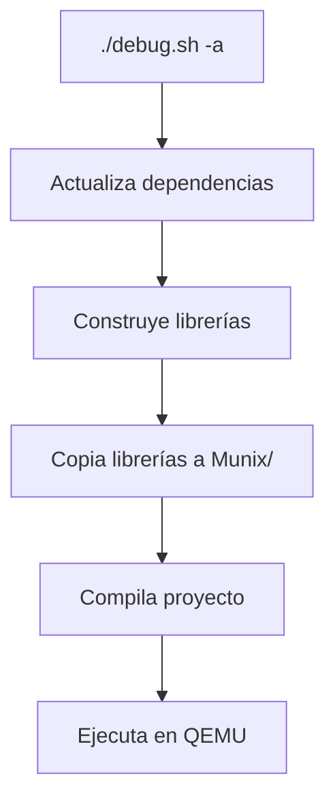

## 🛠️ Scripts de Construcción: `debug.sh`

Este script automatiza múltiples tareas de desarrollo para Munix, desde la compilación hasta la ejecución en QEMU.

### 📋 Uso Básico
```bash
./debug.sh [comando]
```

### 🔧 Comandos Disponibles

| Comando       | Descripción                                                                 | Dependencias                     |
|---------------|-----------------------------------------------------------------------------|----------------------------------|
| `update`      | Actualiza las dependencias (libcs2)                                         | `../upcpkg`                      |
| `compile`     | Ejecuta el script de compilación principal (`compile.sh`)                   | `compile.sh`                     |
| `build-libs`  | Construye todas las librerías desde el directorio `libs/`                   | `libs/build.sh`                  |
| `run`         | Ejecuta Munix en QEMU (i386) con soporte para depuración (`-s`)             | `qemu-system-i386`, `munix.iso`  |
| `liball`      | Preparación completa de librerías: actualiza, construye y copia al proyecto | `mkdir`, `cp`, `rm`              |
| `all`         | Compilación y ejecución completa                                            | Requiere `compile.sh`            |
| `-a`          | **Modo All-in-One**: Ejecuta `liball` seguido de `all`                      | Todas las anteriores             |

### 🎯 Ejemplos de Uso

1. **Flujo de desarrollo completo:**
   ```bash
   ./debug.sh -a
   ```
   *Equivalente a:*
   ```bash
   ./debug.sh update && \
   ./debug.sh build-libs && \
   ./debug.sh compile && \
   ./debug.sh run
   ```

2. **Solo compilar y ejecutar:**
   ```bash
   ./debug.sh all
   ```

3. **Reconstruir librerías:**
   ```bash
   ./debug.sh liball
   ```

### 🔍 Detalles Técnicos

1. **Estructura de Directorios Esperada:**
   ```
   proyecto/
   ├── debug.sh
   ├── compile.sh
   ├── libs/
   │   └── build.sh
   ├── Munix/
   │   └── libs/      # Creado automáticamente
   └── .conduitpkg/   # Dependencias externas
   ```

2. **Opciones de QEMU:**
   - `-s`: Habilita el servidor gdb (puerto 1234)
   - Puedes añadir `-serial stdio` para mejor logging

3. **Variables de Entorno Útiles:**
   ```bash
   export QEMU_OPTS="-m 256M -enable-kvm"
   ./debug.sh run
   ```

### ❌ Manejo de Errores
- Si se pasa un comando no reconocido, muestra: `[ Comando No Reconocido ]`
- Cada etapa muestra claramente cuándo comienza y termina

### 🔄 Flujo de Trabajo Recomendado
